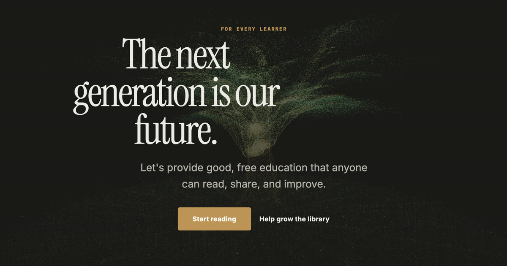

# Open Free Books

[![DeepWiki](https://img.shields.io/badge/DeepWiki-HananoshikaYomaru%2Fopenfreebooks-blue.svg?logo=data:image/png;base64,iVBORw0KGgoAAAANSUhEUgAAACwAAAAyCAYAAAAnWDnqAAAAAXNSR0IArs4c6QAAA05JREFUaEPtmUtyEzEQhtWTQyQLHNak2AB7ZnyXZMEjXMGeK/AIi+QuHrMnbChYY7MIh8g01fJoopFb0uhhEqqcbWTp06/uv1saEDv4O3n3dV60RfP947Mm9/SQc0ICFQgzfc4CYZoTPAswgSJCCUJUnAAoRHOAUOcATwbmVLWdGoH//PB8mnKqScAhsD0kYP3j/Yt5LPQe2KvcXmGvRHcDnpxfL2zOYJ1mFwrryWTz0advv1Ut4CJgf5uhDuDj5eUcAUoahrdY/56ebRWeraTjMt/00Sh3UDtjgHtQNHwcRGOC98BJEAEymycmYcWwOprTgcB6VZ5JK5TAJ+fXGLBm3FDAmn6oPPjR4rKCAoJCal2eAiQp2x0vxTPB3ALO2CRkwmDy5WohzBDwSEFKRwPbknEggCPB/imwrycgxX2NzoMCHhPkDwqYMr9tRcP5qNrMZHkVnOjRMWwLCcr8ohBVb1OMjxLwGCvjTikrsBOiA6fNyCrm8V1rP93iVPpwaE+gO0SsWmPiXB+jikdf6SizrT5qKasx5j8ABbHpFTx+vFXp9EnYQmLx02h1QTTrl6eDqxLnGjporxl3NL3agEvXdT0WmEost648sQOYAeJS9Q7bfUVoMGnjo4AZdUMQku50McDcMWcBPvr0SzbTAFDfvJqwLzgxwATnCgnp4wDl6Aa+Ax283gghmj+vj7feE2KBBRMW3FzOpLOADl0Isb5587h/U4gGvkt5v60Z1VLG8BhYjbzRwyQZemwAd6cCR5/XFWLYZRIMpX39AR0tjaGGiGzLVyhse5C9RKC6ai42ppWPKiBagOvaYk8lO7DajerabOZP46Lby5wKjw1HCRx7p9sVMOWGzb/vA1hwiWc6jm3MvQDTogQkiqIhJV0nBQBTU+3okKCFDy9WwferkHjtxib7t3xIUQtHxnIwtx4mpg26/HfwVNVDb4oI9RHmx5WGelRVlrtiw43zboCLaxv46AZeB3IlTkwouebTr1y2NjSpHz68WNFjHvupy3q8TFn3Hos2IAk4Ju5dCo8B3wP7VPr/FGaKiG+T+v+TQqIrOqMTL1VdWV1DdmcbO8KXBz6esmYWYKPwDL5b5FA1a0hwapHiom0r/cKaoqr+27/XcrS5UwSMbQAAAABJRU5ErkJggg==)](https://deepwiki.com/HananoshikaYomaru/openfreebooks)

> Work in Progress. I am looking for contributors to help build this project. Educators and engineer welcome. 

Free, open-source textbooks for every learner — from elementary school through university. The site is fully static, open on GitHub, and deployed to Cloudflare.

**Live site:** [openfreebooks.org](https://openfreebooks.org)

## Stack

| Layer | Tool |
|-------|------|
| Site generator | [Zola](https://www.getzola.org/) |
| Theme | Custom theme in `themes/openfreebooks/` |
| Interactivity | [Solid.js](https://www.solidjs.com/) (header, marquee, scroll reveal, theme toggle) |
| JS build | [Bun](https://bun.sh/) + [Vite](https://vite.dev/) |
| Search | [Pagefind](https://pagefind.app/) (post-build index, Component UI) |
| Hosting | Cloudflare Workers (static assets via Wrangler) |

Chapter content is **HTML partials** in the theme today (not Markdown). Catalog maps use a Mermaid-powered interactive tree view (pan/zoom).

**Contributing curriculum, subjects, or chapters?** See [CONTRIBUTING.md](CONTRIBUTING.md).

## Prerequisites

- [Zola](https://www.getzola.org/documentation/getting-started/installation/) 0.19+
- [Bun](https://bun.sh/) (for frontend build)
- [Wrangler](https://developers.cloudflare.com/workers/wrangler/) 4.x (for deploy)

## Project layout

```
content/                 # Pages and sections (Markdown front matter)
data/                    # Catalog + per-subject curriculum JSON
static/                  # Site assets copied to public/ (favicons, _redirects)
themes/openfreebooks/    # Zola theme
  templates/             # HTML (Tera)
  sass/                  # Stylesheets (compiled to main.css)
  static/js/bundle.js    # Built Solid bundle (committed for simple deploys)
frontend/src/            # Solid.js source
public/                  # Zola build output (gitignored) — Wrangler deploy target
wrangler.jsonc           # Cloudflare Workers static assets config
```

## Development

Install JS dependencies:

```bash
bun install
```

Serve locally:

```bash
bun run dev
```

Open [http://127.0.0.1:1111](http://127.0.0.1:1111).

Search UI is available in local serve; run a build command to refresh the search index (`static/pagefind/` is gitignored and copied from build output).

## Build commands

```bash
bun run build:chapter math/measures-dispersion math/loci
bun run build:chapter math/*
bun run build:chapter   # auto-detect changed chapters, list them, ask for confirmation
bun run build:site      # full site build (includes sponsor sync when GITHUB_TOKEN is set)
bun run build           # alias of build:site
```

`build:chapter` updates chapter sync, chapter widget JS (targeted), metadata, site output, and search index.

In non-interactive environments, `build:chapter` requires explicit chapter arguments.

## Testing

```bash
bun test
```

`bun test` includes curriculum validation.

## Deploy to Cloudflare

```bash
bun run build
wrangler deploy
```

The Worker name is `openfreebooks` (see `wrangler.jsonc`). Assets are served from `public/` with no server-side logic.

## Configuration

Site-wide settings live in `zola.toml`:

- `base_url` — canonical URL for feeds and absolute links
- `[extra]` — `site_title`, `github_url`, `browse_url`, `search_url`, `about_url` (used in templates and the Solid config block)

## Theme notes

The visual design is inspired by [manlung.work](https://manlung.work/): paper background with grain, Instrument Serif headings, warm ochre accent (`#9a6b2e`), and light/dark mode (system preference plus a toggle).

**Keep `themes/openfreebooks/static/` clean.** Only committed built assets belong there (currently `js/bundle.js`). Do not copy Zola’s `public/` output into the theme `static/` folder — that pollutes `public/js/` on the next build.

## Contributor experience — known friction (task list)

These issues make contributions harder than they should be. PRs that fix any item are welcome.

## Agent skills

| Skill | Path | Use |
|-------|------|-----|
| **OFB (this project)** | [.agents/skills/ofb/SKILL.md](.agents/skills/ofb/SKILL.md) | Catalog, curriculum JSON, chapters, product rules |
| **Zola + Solid** | [.agents/skills/zola/SKILL.md](.agents/skills/zola/SKILL.md) | Templates, Sass, bundle, `zola serve` |

## License

Open source — see the repository license file when added.
